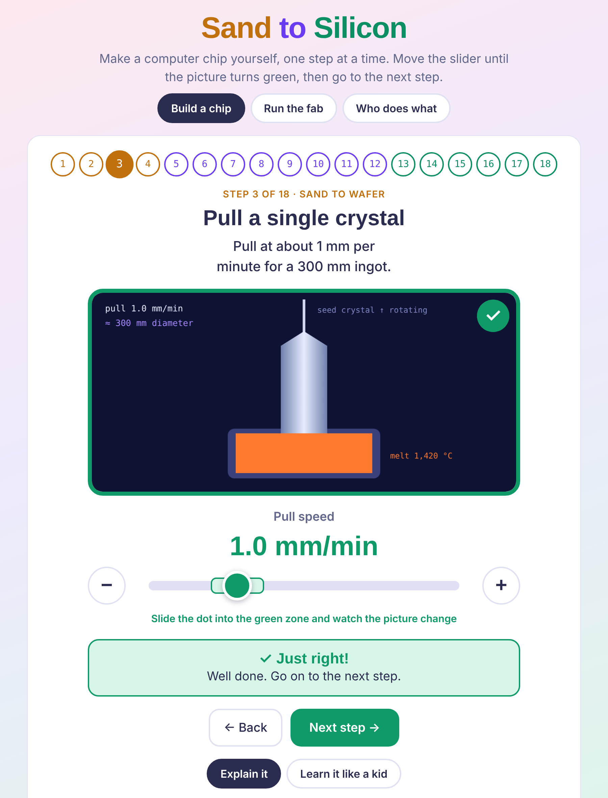
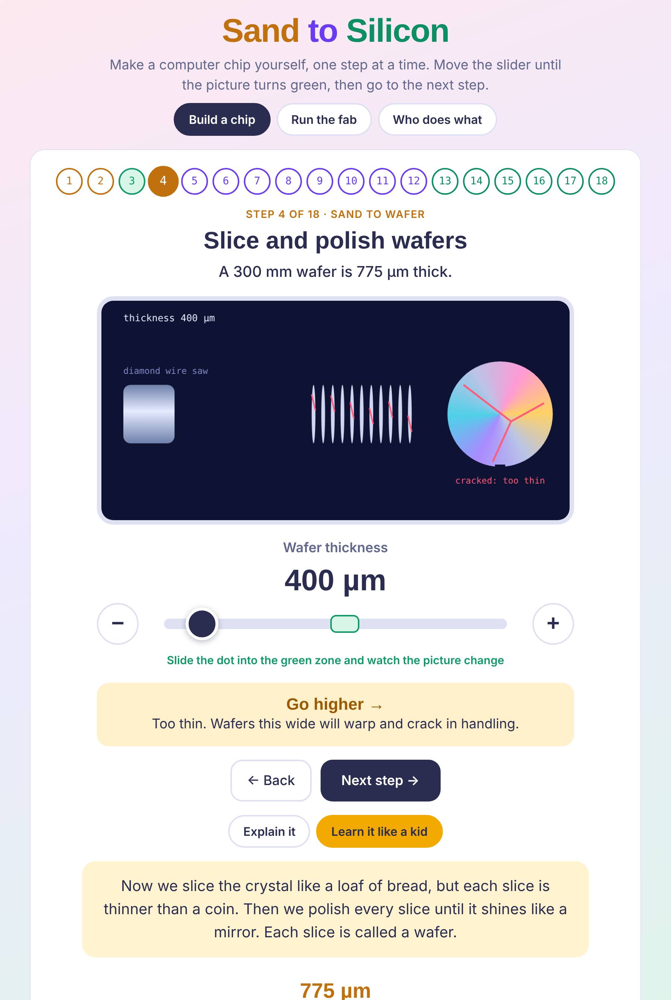
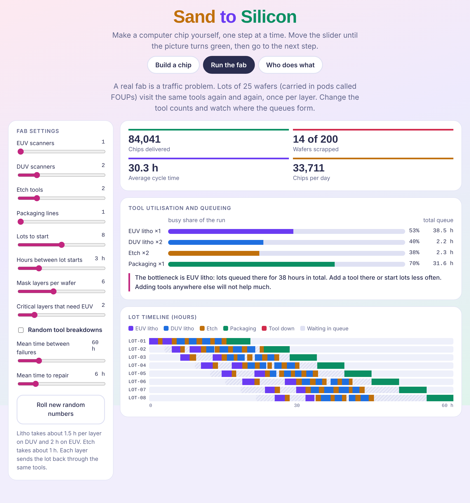

# Sand to Silicon

An interactive simulator for learning how computer chips are made, from sand to a working device.



## What is in it

- **Build a chip**: 18 steps across three phases (sand to wafer, wafer to die, die to device). Move the slider into the green zone and watch the picture change. Each step has a plain explanation and a "Learn it like a kid" version.
- **Run the fab**: a discrete-event simulation of a wafer fab. Lots of 25 wafers queue for EUV scanners, DUV scanners, etch tools and packaging lines. Change the tool counts, add random breakdowns (MTBF and MTTR), and see where the bottleneck forms.
- **Who does what**: the kinds of company in the semiconductor chain, with examples.

## Screenshots

Move a slider and the picture shows what happens. Here the wafers are sliced too thin and crack. "Learn it like a kid" explains the step for a 10-year-old.



The fab simulation shows tool utilisation, the bottleneck, and a timeline of every lot.



## Run it

Open `index.html` in any browser. There is nothing to install. The whole simulator is that one file.

## Run it as a desktop app

```
npm install
npm start
```

To build a Mac app (Apple Silicon):

```
npm run build:mac
```

## Notes

- Yield and loss numbers in "Build a chip" are illustrative. They are chosen to make cause and effect visible and are not real fab data.
- Company names and market facts were written from general knowledge and have not been checked against sources.
- Fonts load from Google Fonts when online. Offline, the page falls back to system fonts.
